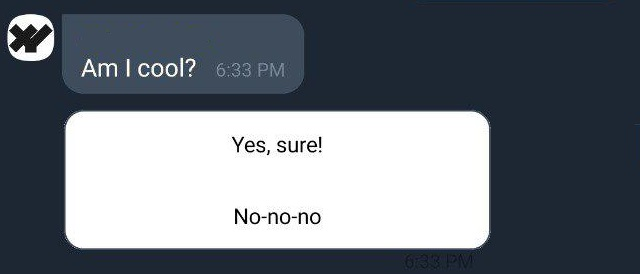

<p align="center">
    
</p>
<h2 align="center">Ant:Viber</h2>
<p align="center">
  Tiny but powerful framework for <a href="https://www.viber.com/">Viber</a> chat bots.
</p>
<p align="center">
  This framework is viber adaptation of <a href="https://www.npmjs.com/package/ant-telegram">Ant:Telegram</a>.
</p>
<p align="center">
    <a href="https://developers.viber.com/docs/api/rest-bot-api/">
        
    </a>
    <a href="https://www.npmjs.com/package/ant-viber">
        
    </a>
    <a href="https://www.npmjs.com/package/ant-viber">
        
    </a>
    <a href="https://travis-ci.org/Xeelley/AntViber">
        
    </a>
</p>


## List of content ##

About: 
- [Basic features](#Basic-features) 
- [Instalation](#Instalation) 
- [Basic usage](#Basic-usage) 
- [Ant anatomy](#Ant-anatomy) 
- [Rich media, payload data handling](#rich-media-payload-data-handling)
- [Deep linking](#deep-linking)
- [Config](#Config)
- [Examples](#Examples)


## Basic features ##

- Status-based user dialog stage managment.
- Easy-to-use.
- Based on official [Node.js Viber library](https://github.com/Viber/viber-bot-node).
- All in one: all official API methods and types, flexible dialog flow control.
- w/o functional overkill, nothing extra.


## Instalation ##

- Using [NPM](https://www.npmjs.com/):  
`npm install ant-viber`
- Using [Yarn](https://yarnpkg.com/en/):  
`yarn add ant-viber`


## Basic usage ##

Ant:Viber require to provide 2 basic status managment async methods: for getting status to user by viber `id`, and for setting it.  
Feel free to chose storing way (architecture, database etc.). We require next interfaces only:
```ts
getStatus(id: string): Promise<String>;
setStatus(id: string, status: String): Promise<any>;
``` 

Just put in on Ant:Viber initialization with viber bot access token, bot name and avatar link:
```js
const { AntViber } = require('ant-viber');

const bot_token  = '...'; // Your viber bot access token token
const bot_name   = 'my_bot';
const bot_avatar = 'https://www.domain.com/avatar.jpg'; // Image direct link

const Ant = new AntViber(bot_token, bot_name, bot_avatar, { 
    getStatus: (id) => { ... }, 
    setStatus: (id, status) => { ... },
});
```

**Notice**: you must pass empty string (`''`) if you don't need to override avatar for viber client or viber admin pannel:
```js
const Ant = new AntViber(bot_token, bot_name, '', { ... })
```

Explore quick start [example](docs/mongo-status-example.md) using [MongoDB](https://www.mongodb.com/) + [mongoose](https://www.npmjs.com/package/mongoose).

Next you need to configure webhook and add middleware (using [Express.js](https://expressjs.com/) in example):
```js
const express = require('express');
const app = express();
const webhookUrl = '/webhook';

app.use(webhookUrl, Ant.middleware());
await Ant.setWebhook('https://www.domain.com' + webhookUrl);
app.listen(...)
```

**Notice:** https support required for viber webhook. Self-signed SSL certificates not supported!

Now you ready to use Ant:Viber.

When new user connect to your bot (create subscription), bot will send start button using `RichMedia`. Text on button you can change using `startButtonText` parameter in config. This button send `/start` command when pressed.

Let's add handler for `/start` command:
```ts
Ant.command('/start', async user => {
    await Ant.sendMessage(user, [ Ant.Types.TextMessage('Hi!') ]);
}) 
```

Your bot ready to start. Run script and make sure it works:  


## Ant anatomy ##

### Viber API 

Ant:Viber use official library so you can use `Ant.sendMessage` method for sending message to user:
```ts
Ant.sendMessage(user: userProfile, messages: Viber.message[])
```

`userProfile` is viber user object. Each listener returns `userProfile`.


### Events

Error handling: 
```js
// Viber API response errors
Ant.on('error', err => { ... })
```

Also Ant:Viber has `Error` generalization:
```js
Ant.on('Error', err => { ... })
```
`Error` will fire on any error. If error caused during user's scenario, error will have `user_id` extra field.


### Statuses

Set status for user:
```js
await Ant.status(id, 'my_status');
```
**Notice:** `id` is `user.id` so you can easily get id from `userProfile`. 

And add listener for this status: 
```js
Ant.add('sticker', 'my_status', (user, stickerId) => { ... }) 
```
First argument is user interaction type, second - our status, third - callback.  
Callback will invoke every time when user with this status send sticker to bot.  
Full list of available types and callbacks you can check [here](docs/event-types.md).  
`user` is `userProfile` (see [Viber API](#Viber-API)).


### Commands

Add command handlers using `Ant.command`:
```js
Ant.command(command, (user, params, user, message) => { ... })
```
Command may contain `/` if needed (example: `/start`).
Callback will invoke every time when user send this command to chat (either as text message or from rich message payload). Status will be ignored (works with any user's status).  
  
`Ant.command` support url params for commant that will returns as `params` in callback. Empty object will returns if params not provided.  
For example:  

| User input | `params` value |
|---|---|
| `/cmd` | `{}` |
| `/cmd?item=apple&amount=2` | `{ item: 'apple', amount: '2' }` |

Notice: all param values are strings. You need to parse params by youself if you need to support other types in command params.  


### Masks 

You can use multi-leveled statuses using level separator (`:` by default). It can be changed using `maskSeparator` field in initial config.   
For example: 
```js
await Ant.status(id, 'buy:fruit:apple')
```
Provided status has 3 levels: action (`buy`), category (`fruit`), item (`apple`) and can be used during user interaction  with shopping cart.  
You not need to set listeners using `Ant.add` for each item on third level. You can use mask (`*`):
```js
// Mask value (item, in our case) will be provided as third callback parameter.
Ant.add('message', 'buy:fruit:*', (user, text, item) => {
    console.log(item) // apple
})
```
Callback will invoke for any text message send by user with any item in status.


### Builders ### 
See `Ant.Types`

Ant:Viber simplifies api methods and types usage with builders.  
Let's check examples:
```js
await Ant.sendMessage(user, [
    Ant.Types.TextMessage('Am I cool?'),
    Ant.Types.RichMedia([
        Ant.Types.RichKeyboardButton('Yes, sure!', 'coolmenu:yes'),
        Ant.Types.RichKeyboardButton('No-no-no', 'coolmenu:no'),
    ], 2)
])

await Ant.sendMessage(user, [
    new Ant.Types.Location(41.2362873, -87.6504762),
    new Ant.Types.Url('https://www.google.com'),
])
```
In first example we use builders instead of define `options` object. This code will send rich media with two buttons:  



In second example we use types which don't need extra options.  
  
**Notice:** types without extra options can be used either as functions or as classes (with `new`). Types with extra options (`RichMedia`, `Keyboard`, `ReplyKeyboardButton`, `RichKeyboardButton`, `UrlKeyboardButton`) can't be used as classes for context lossing preventing.


## Deep linking ##
Viber supports [deep linking](https://developers.viber.com/docs/tools/deep-links/) so you can create link like:
```
viber://pa?chatURI=<URI>&context=<Your Context>
```
which start user scenario with context value. You can handle context easily:
```js
// Via viber://pa?chatURI=yourbot&context=value
Ant.command('/start', async (user, params) => {
    console.log(params); // { context: 'value' }
    console.log(params.context) // 'value'
})
```
`Ant.command` listener provide params object as second parameter. It will be empty when user has been connected to bot 
without deep link.


## Rich media, payload data handling ##
Using [builders](#Builders) you can define `rich_payload` type and data directly (second and third parameter in `Ant.Types.RichKeyboardButton`).  
Example:
```js
await Ant.sendMessage(user, [
    Ant.Types.TextMessage('Click button below for getting colorful gift'),
    Ant.Types.RichMedia([
        Ant.Types.RichKeyboardButton('Click!', 'gift', 'red'),
    ], 2)
])
```
It will send test message with text and rich media below with one button that have `gift` type and data.  
How to handle it? Use known `Ant.add` handler!
```js
Ant.add('rich_payload', 'gift', async (user, payload) => {
    console.log(payload) // "red"
})
```

**Notice**: Ant:Viber `Ant.Types.RichKeyboardButton` builder add `data` to message.  
So final payload is string that created as: 
```ts
payload = type + separator + string
```
Separator is equal to `$:` by default and can be changed using `richPayloadDataSeparator` field in initial config.  
So payload for expample will be equal to `'gift$:red'`.  


## Config ##
Ant:Viber init config contain next fields:

| field | type | description |
|-------|------|-------------|
| `setStatus` | | See [basic usage](#Basic-usage) 
| `getStatus` | | See [basic usage](#Basic-usage) 
| `maskSeparator` | `string` | See [masks](#Masks)
| `richPayloadPrefix` | `string` | Prefix for marking payload source: rich media if message with prefix, either text or reply message otherwise. Using if internal Ant:Viber processes only.
| `startButtonText` | `string` | Text on dialog start button (when new user subcribed), see [basic usage](#Basic-usage) 
| `richPayloadDataSeparator` | `string` | See [Rich media, payload data handling](#rich-media-payload-data-handling)
| `keyboardSettings.backgroundColor` | `string` | RGA or HEX color of button panels (both reply and rich media) background
| `keyboardSettings.buttonColor` | `string` | RGA or HEX color of button (background color)
| `keyboardSettings.frameColor` | `string` | **Deprecated (v.<3.0.0)** RGA or HEX color of button frame 
| `keyboardSettings.BorderWidth` | `number` | **Deprecated (v.<3.0.0)** Button border width in pixels (`2` by default, `0` for hide border)


## Examples ##
- [Location Echo Bot](examples/location-echo-bot.md) - echo bot (using Express.js) that send longitude & latitude to user, every time when user sent location.
